<p align="center">
  
</p>

<p align="center">
  <strong>Coordinate multiple AI models into a single, verified code generation pipeline.</strong>
</p>

<p align="center">
  <a href="#quick-start">Quick Start</a> •
  <a href="#how-it-works">How It Works</a> •
  <a href="#the-arbiter">The Arbiter</a> •
  <a href="#supported-models">Supported Models</a> •
  <a href="docs/architecture.md">Architecture</a> •
  <a href="CONTRIBUTING.md">Contributing</a>
</p>

<p align="center">
  
  
  
</p>

---

## The Problem

You paste code into an AI model. It looks right. You ship it. Then you find the hallucinated import, the missed edge case, the pattern violation that cascades through your codebase.

Single-model code generation has a blindspot problem. Every model has biases, gaps, and failure modes — and the same model that wrote the bug can't reliably find it.

## The Fix

Triad routes your coding task through **multiple AI models in specialized roles**, with an **independent referee** that catches mistakes before they reach your codebase.
```
Task -> [Architect] -> [Implementer] -> [Refactor] -> [Verify] -> Production Code
             |              |              |             |
         Arbiter         Arbiter        Arbiter       Arbiter
      (different model reviews each stage)
```

Each model does what it's best at. A different model checks the work. The code that survives is production-ready.

---

## Quick Start

### Install
```bash
pip install triad-orchestrator
```

### Configure
```bash
cp .env.example .env
# Add your API keys:
#   ANTHROPIC_API_KEY=sk-ant-...
#   OPENAI_API_KEY=sk-...
#   GOOGLE_API_KEY=...
#   XAI_API_KEY=...
```

### Run
```bash
triad run --task "Build a REST API with JWT authentication and rate limiting"
```

That's it. Triad assigns models to roles, runs the pipeline, and the Arbiter reviews the output at each stage. You get production-ready code, tests, and a full audit trail.

---

## How It Works

Triad uses a **sequential pipeline** with four stages. Each stage is handled by whichever model scores highest for that role:

| Stage | Role | What It Does |
|-------|------|-------------|
| **Architect** | Design the solution | Produces a technical scaffold: file structure, interfaces, data models, dependency map. |
| **Implement** | Write the code | Takes the scaffold and produces complete, working implementation with error handling. |
| **Refactor** | Improve and test | Restructures for clarity, adds edge case handling, writes comprehensive test suite. |
| **Verify** | Validate everything | Reviews the complete output for correctness, security, and pattern compliance. |

Models don't just hand off and move on — any model can **suggest improvements** outside its assigned role. The Architect can flag an implementation concern. The Implementer can propose a structural change. Suggestions are tracked, evaluated, and either accepted or escalated to consensus.

---

## The Arbiter

The Arbiter is what makes Triad fundamentally different from running the same prompt through multiple models.

**It's an independent referee.** The Arbiter never writes code. It never proposes architecture. Its only job is to find what's wrong with other models' work.

**It's always a different model.** If Claude wrote the code, GPT-4 or Grok arbitrates. If Gemini designed the architecture, Claude checks it. The system enforces this automatically — the same model never grades its own work.

**It assumes there are bugs.** The Arbiter's prompt starts from skepticism: *"Assume there are errors until proven otherwise."* This inverts the typical AI review pattern where models default to "looks good" and hedge with minor suggestions.

**It can stop the pipeline.** Four verdicts:

| Verdict | Action |
|---------|--------|
| **APPROVE** | Continue. Output is sound. |
| **FLAG** | Continue, but inject warnings for the next stage to address. |
| **REJECT** | Re-run this stage with structured feedback. Max 2 retries. |
| **HALT** | Stop everything. Present analysis for human decision. |

When the Arbiter rejects, it doesn't just say "this is wrong." It provides structured feedback with severity, category, exact location, evidence, and a suggested fix — all injected into the retry prompt so the generating model knows exactly what to address.

### Configurable Review Depth

Not every task needs full review. Choose your safety level:
```bash
triad run --task "..." --arbiter full       # Review every stage (critical features)
triad run --task "..." --arbiter bookend    # Review architecture + final output (default)
triad run --task "..." --arbiter final      # Review final output only (prototypes)
triad run --task "..." --arbiter off        # No review (rapid iteration)
```

---

## Supported Models

Triad is **model-agnostic**. Any LLM that supports chat completions works. Add a new model by adding a TOML entry — no code changes required.

### Pre-Configured Providers

| Provider | Models | Best At |
|----------|--------|---------|
| **Anthropic** | Claude Opus, Sonnet, Haiku | Refactoring, verification, nuanced review |
| **OpenAI** | GPT-4o, o3-mini | Fast implementation, broad language support |
| **Google** | Gemini 2.5 Pro, Flash | Architecture, large context reasoning |
| **xAI** | Grok 4, Grok 3 | Independent analysis, alternative perspectives |

### Adding Models
```toml
# config/models.toml
[models.deepseek-v3]
provider = "deepseek"
model = "deepseek-chat"
roles = ["implement", "refactor"]
cost_per_1k_input = 0.0001
cost_per_1k_output = 0.0002
```

DeepSeek, Llama, Mistral, Ollama (local), vLLM (self-hosted) — if LiteLLM supports it, Triad supports it.

---

## Pipeline Modes

| Mode | How It Works | Best For |
|------|-------------|----------|
| **Sequential** (default) | Architect → Implement → Refactor → Verify, each building on the last | Standard development, most tasks |
| **Parallel** | All models solve independently, cross-review, vote on best, synthesize | Exploring multiple approaches |
| **Debate** | Position papers → rebuttals → final arguments → judgment | Architectural decisions, tradeoff analysis |

```bash
triad run --task "..." --mode sequential   # Default
triad run --task "..." --mode parallel     # Fan-out + consensus
triad run --task "..." --mode debate       # Structured debate
```

---

## Smart Routing

Triad assigns models to pipeline roles based on fitness benchmarks — each model is scored on how well it performs as Architect, Implementer, Refactorer, and Verifier. Four routing strategies let you optimize for what matters:

| Strategy | Behavior |
|----------|----------|
| **quality-first** | Best model per role regardless of cost |
| **cost-optimized** | Cheapest model above fitness threshold |
| **speed-first** | Lowest-latency models preferred |
| **hybrid** (default) | Quality for critical stages, cost-optimized for early stages |

```bash
triad run --task "..." --route hybrid          # Default
triad run --task "..." --route quality-first   # Max quality
triad estimate --task "..." --compare-routes   # Compare costs
```

---

## CLI Commands

| Command | Description |
|---------|-------------|
| `triad run` | Run a full pipeline on a task |
| `triad plan` | Expand a rough idea into a structured task spec |
| `triad estimate` | Estimate cost before running |
| `triad review` | Multi-model PR review (CI/CD integration) |
| `triad models list` | Show registered models with fitness scores |
| `triad models check` | Verify API key connectivity |
| `triad config show` | Display current pipeline configuration |
| `triad sessions list` | Browse past pipeline runs |
| `triad sessions show` | View full session details |
| `triad dashboard` | Launch real-time browser visualization |

```bash
# Run a task with default settings
triad run --task "Add WebSocket support to the existing Express server"

# Plan first, then run
triad plan "Build a data processing pipeline" --run

# Review a PR diff
triad review --diff changes.patch --fail-on critical

# Launch the real-time dashboard
triad dashboard --port 8420
```

The CLI uses [Rich](https://github.com/Textualize/rich) for live terminal output — real-time agent status, streaming responses, color-coded Arbiter verdicts, and a cost summary when the pipeline completes.

---

## Custom Domain Rules

Triad supports domain-specific verification rules that the Arbiter checks in addition to general code quality:
```toml
# config/domain/my_rules.toml
[rules.schema_consistency]
description = "All database models must use integer primary keys"
severity = "critical"
pattern = "UUIDField|uuid4"
action = "reject"

[rules.test_coverage]
description = "Every new service must have corresponding test file"
severity = "warning"
```

We use Triad to build a financial services platform — our custom rules enforce schema patterns, threading conventions, and audit trail requirements specific to our domain. You can do the same for yours.

---

## How We Use It

We built Triad because we needed it. Our team uses Triad as the primary development workflow for a financial services operating system with 2,900+ tests. Every new feature, every module, every refactor goes through the pipeline. The Arbiter has caught schema mismatches, hallucinated dependencies, over-engineered abstractions, and integration failures — all before code review.

Triad isn't a research project. It's a production tool that we bet our own codebase on every day.

---

## Cost

Triad adds model calls, which cost tokens. Here's what a typical task looks like:

| Configuration | Est. Cost per Task | Use Case |
|--------------|-------------------|----------|
| No Arbiter | ~$4.30 | Rapid iteration |
| Final Only | ~$5.10 | Prototyping |
| **Bookend (default)** | **~$5.80** | Standard development |
| Full Arbiter | ~$7.30 | Critical features |

At the default Bookend depth and ~15 tasks/week, the Arbiter adds about **$90/month**. One production bug it catches pays for a year of reviews.

---

## Documentation

| Document | Description |
|----------|-------------|
| [Architecture](docs/architecture.md) | Core pipeline design, consensus protocol, technology stack |
| [Model-Agnostic System](docs/model-agnostic.md) | Plugin architecture, LiteLLM adapter, dynamic role assignment |
| [Arbiter Layer](docs/arbiter.md) | Independent review system, verdicts, feedback injection |
| [Build Spec](docs/build-spec.md) | MVP scope, day-by-day build plan, technical decisions |

---

## Architecture

```
triad/
├── cli.py                  # Typer + Rich terminal interface
├── orchestrator.py         # Pipeline engine (sequential, parallel, debate)
├── planner.py              # Task planner (triad plan)
├── providers/              # LiteLLM adapter + model registry
├── routing/                # Fitness-based model-to-role assignment
├── arbiter/                # Independent adversarial review engine
├── consensus/              # Cross-domain suggestions + voting protocol
├── context/                # AST-aware codebase scanner + context builder
├── persistence/            # SQLite session storage + export
├── ci/                     # Multi-model PR review for CI/CD
├── dashboard/              # Real-time WebSocket visualization (optional)
├── schemas/                # Pydantic v2 models (all data contracts)
├── prompts/                # Jinja2 role prompt templates
├── output/                 # File writer + Markdown report renderer
└── config/                 # TOML configuration (models, defaults, routing)
```

---

## Contributing

We welcome contributions! Please read [CONTRIBUTING.md](CONTRIBUTING.md) before submitting a PR.

**Important:** All contributors must sign our [Contributor License Agreement](CLA.md) before their first PR can be merged. This is handled automatically via CLA Assistant — you'll be prompted when you open your first PR.

---

## License

Apache 2.0 — see [LICENSE](LICENSE) for details.

---

<p align="center">
  <sub>Built by <a href="https://github.com/nexusai">NexusAI</a> — Any model. Any role. The protocol is the product.</sub>
</p>
