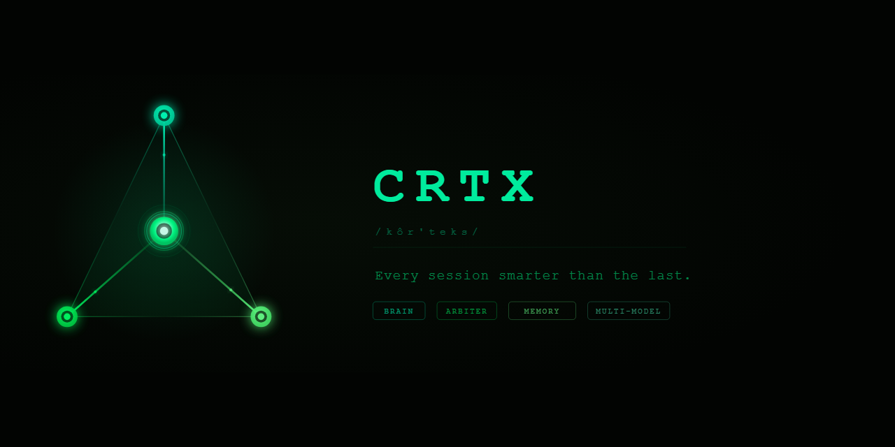

<p align="center">
  
</p>

<p align="center">
  <strong>Multi-model AI orchestration with adversarial verification.</strong>
</p>

<p align="center">
  <a href="#quick-start">Quick Start</a> •
  <a href="#how-it-works">How It Works</a> •
  <a href="#the-arbiter">The Arbiter</a> •
  <a href="#supported-models">Supported Models</a> •
  <a href="#commands">Commands</a> •
  <a href="#contributing">Contributing</a>
</p>

<p align="center">
  
  
  
</p>

---

## What is CRTX?

Most AI coding tools send your prompt to one model and hope for the best. CRTX sends it to multiple models and makes them argue about it.

Here's what actually happens when you run a task: an Architect designs the approach. An Implementer writes the code. A Refactorer cleans it up. A Verifier checks it. And then an independent Arbiter — running on a *different* model than the one that wrote the code — reviews everything and decides if it's good enough to ship.

If it's not? The Arbiter sends it back with specific feedback. The pipeline runs again. No human intervention required.

The result is code that's been debated, reviewed, and stress-tested by multiple AI models before you ever see it.

## Quick Start

```bash
pip install crtx
crtx setup        # configure your API keys
crtx demo         # 60-second guided first run
```

Or jump straight in:

```bash
crtx run "Build a REST API with authentication and rate limiting"
```

That's it. CRTX handles model selection, stage routing, cost optimization, and cross-model review automatically.

## How It Works

Every task flows through a pipeline of specialized stages. Each stage can be assigned to a different AI model based on what it's best at.

**Sequential mode** (the default) chains four stages together:

1. **Architect** — Designs the approach, defines file structure, picks patterns
2. **Implement** — Writes the actual code based on the architect's plan
3. **Refactor** — Cleans up the implementation: better names, fewer bugs, tighter logic
4. **Verify** — Reviews the final output for correctness, edge cases, and test coverage

Each stage receives the output of the previous one. The Architect's plan feeds the Implementer. The Implementer's code feeds the Refactorer. Context accumulates — nothing gets lost between stages.

CRTX also supports **parallel mode** (all models solve independently, then cross-review and merge the best approach) and **debate mode** (models write position papers, rebuttals, and final arguments before a judge picks the winner).

## The Arbiter

This is the thing that makes CRTX different from just chaining API calls together.

The Arbiter is an independent reviewer that uses a *different model* than the one that generated the code. It's adversarial by design — its job is to find problems, not to agree.

It returns one of four verdicts:

- **APPROVE** — Code meets the spec, no issues found
- **FLAG** — Minor concerns, but acceptable to ship
- **REJECT** — Significant issues, sends structured feedback back to the pipeline for retry
- **HALT** — Critical problems, stops the pipeline immediately

The Arbiter enforces a confidence floor: if a model says "APPROVE" but its confidence score is below 0.50, CRTX automatically downgrades it to FLAG. Low-confidence approvals are meaningless.

You can control how much review you want with `--arbiter off|final_only|bookend|full`. The default is `bookend` — the Arbiter reviews the Architect's plan and the Verifier's final output.

## Smart Routing

Not every model is good at everything. CRTX knows this.

The routing engine assigns models to stages based on fitness scores, task type, and your chosen strategy:

- **quality_first** — Best model for each stage regardless of cost
- **cost_optimized** — Cheapest model that meets a minimum quality threshold
- **speed_first** — Fastest model per stage
- **hybrid** (default) — Quality-first for critical stages (refactor, verify), cost-optimized for everything else

Cross-stage diversity is enforced: no single model gets assigned more than 2 stages. This prevents monoculture — you want different perspectives reviewing the code, not the same model grading its own homework.

## Auto-Fallback

If a provider goes down mid-pipeline (rate limit, timeout, outage), CRTX automatically substitutes the next best model and keeps going. No manual intervention, no restart required. A 5-minute cooldown prevents hammering a struggling provider.

## Apply Mode

Generated code doesn't have to stay in the terminal. CRTX can write it directly to your project:

```bash
crtx run "Add WebSocket support to the chat server" --apply
```

This gives you an interactive diff preview where you select which files to write. Add `--confirm` to skip the preview and write immediately.

Safety features: git branch protection (won't write to main/master), conflict detection via SHA-256 checksums, AST-aware patching, and automatic rollback if post-apply tests fail.

## Streaming Display

Pipeline output streams in real-time, token by token. You'll see syntax-highlighted code blocks as they're generated, with a pinned status bar at the bottom showing stage progress, running cost, and token count.

Stage indicators update live: ○ pending → ◉ active → ● complete → ⚠ fallback → ✗ failed.

## Context Injection

CRTX can scan your project and inject relevant code into the pipeline:

```bash
crtx run "Write tests for the auth module" --context .
```

It uses AST-aware Python analysis to extract class signatures, function definitions, and import graphs — then selects the most relevant files within a configurable token budget. Your models see your actual code patterns, not generic examples.

## Supported Models

CRTX works with any model supported by LiteLLM — that's 100+ providers. Out of the box, it's configured for:

| Provider | Models |
|----------|--------|
| Anthropic | Claude Opus 4, Sonnet 4 |
| OpenAI | GPT-4o, o3 |
| Google | Gemini 2.5 Pro, Flash |
| xAI | Grok |

Add any LiteLLM-compatible model in `~/.crtx/config.toml`.

## Commands

| Command | What it does |
|---------|-------------|
| `crtx run "task"` | Run a pipeline |
| `crtx demo` | Guided first-run experience |
| `crtx review-code` | Multi-model code review on files or git diffs |
| `crtx improve` | Review → improve pipeline with cross-model consensus |
| `crtx repl` | Interactive shell with session history |
| `crtx setup` | API key configuration |
| `crtx models` | List available models with fitness scores |
| `crtx estimate "task"` | Cost estimate before running |
| `crtx sessions` | Browse past runs |
| `crtx replay <id>` | Re-display a previous session |
| `crtx dashboard` | Real-time web dashboard |

### Presets

Don't want to think about configuration? Use a preset:

```bash
crtx run "task" --preset fast       # Sequential, streaming, cost-optimized
crtx run "task" --preset thorough   # Full arbiter, quality-first routing
crtx run "task" --preset cheap      # Minimum cost, speed routing
crtx run "task" --preset explore    # Parallel mode, all models
crtx run "task" --preset debate     # Debate mode with judgment
```

## Architecture

```
┌──────────────┐     ┌──────────────┐     ┌──────────────┐     ┌──────────────┐
│   Architect  │ ──→ │  Implementer │ ──→ │  Refactorer  │ ──→ │   Verifier   │
│  (Claude)    │     │  (GPT-4o)    │     │  (Claude)    │     │    (o3)      │
└──────────────┘     └──────────────┘     └──────────────┘     └──────────────┘
                                                                       │
                                                                       ▼
                                                               ┌──────────────┐
                                                               │   Arbiter    │
                                                               │  (Gemini)    │
                                                               └──────────────┘
                                                                       │
                                                              APPROVE / REJECT
```

The Arbiter always runs on a different model than the generators. Cross-model review catches errors that self-review misses.

## Philosophy

**Evidence over claims.** The Arbiter doesn't trust self-reported confidence. It verifies independently.

**Diversity over consensus.** Multiple models with different training data and different failure modes produce better results than one model reviewing its own work.

**Safety by default.** Apply mode previews before writing. Git branches are protected. Tests run after apply. Rollback is automatic.

**Transparency over magic.** Every routing decision, every token cost, every arbiter verdict is logged and visible. `crtx sessions` shows you exactly what happened and why.

## Contributing

Contributions are welcome. Fork the repo, create a branch, and submit a PR.

The test suite has 1,045 tests — run them with `pytest`. Linting is `ruff check .`.

## License

Apache 2.0. See [LICENSE](LICENSE) for details.

---

<p align="center">
  Built by <a href="https://crtx-ai.com">TriadAI</a>
</p>
